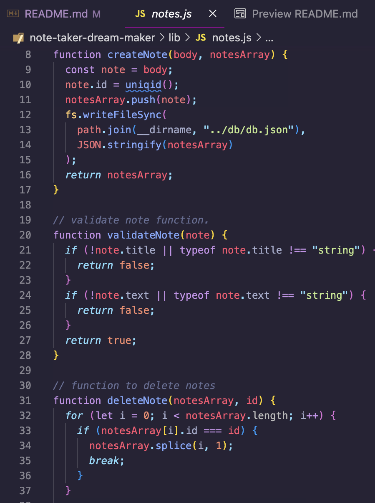

# Note Taker

## License
### 
### [MIT](https://opensource.org/licenses/MIT)

## Description

This application uses Express.js and Node to dynamically generate a note taking dashboard through HTML.

By: [Vincent Toon](https://github.com/vincenttoon)

## Table of Contents

* [Installation](#installation)

* [Usage](#usage)  

* [Contributors](#contributors)

* [Tests](#tests)

* [Questions?](#questions)

## Installation

* Head to the repository to download or view this code: [Note Taker](https://github.com/Vincenttoon/note-taker-dream-maker)

* Install node (npm i). Install express (npm i express).

## Tests

[Video Demonstration](https://drive.google.com/file/d/11jBrdA4ZqEN6k_844GGnrHnk3Z6slGQt/view)

## Usage

* Go to the public project repository and download/clone the code. Install npm. Install express.js (npm i express). Run npm to launch the port, visit the website and fill out your notes!

* Application launches through a local port located in server.js.

* This server calls on separate API and HTML routes with different parameters based on the functionality of the application.

* Functions for these routes are created in notes.js to provide desired functionality.

## Contributors

* Starter code provided by Wash U Fullstack Development Bootcamp through: [Xandromus](https://github.com/coding-boot-camp/miniature-eureka)

## Questions?

Questions, comments, or concerns? Please Email me at:
* vincenttoon22@gmail.com

## User Story
- AS A small business owner
- I WANT to be able to write and save notes
- SO THAT I can organize my thoughts and keep track of tasks I need to complete

## Acceptance Criteria
- GIVEN a note-taking application
- WHEN I open the Note Taker
- THEN I am presented with a landing page with a link to a notes page
- WHEN I click on the link to the notes page
- THEN I am presented with a page with existing notes listed in the left-hand column, plus empty fields to enter a new note title and the note’s text in the right-hand column
- WHEN I enter a new note title and the note’s text
- THEN a Save icon appears in the navigation at the top of the page
- WHEN I click on the Save icon
- THEN the new note I have entered is saved and appears in the left-hand column with the other existing notes
- WHEN I click on an existing note in the list in the left-hand column
- THEN that note appears in the right-hand column
- WHEN I click on the Write icon in the navigation at the top of the page
- THEN I am presented with empty fields to enter a new note title and the note’s text in the right-hand column
